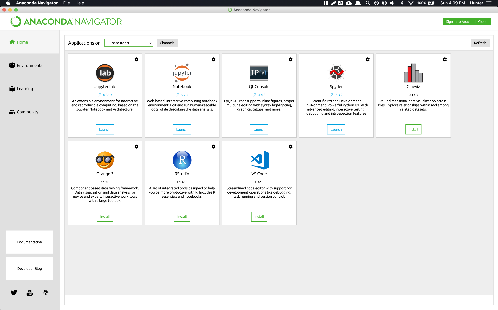
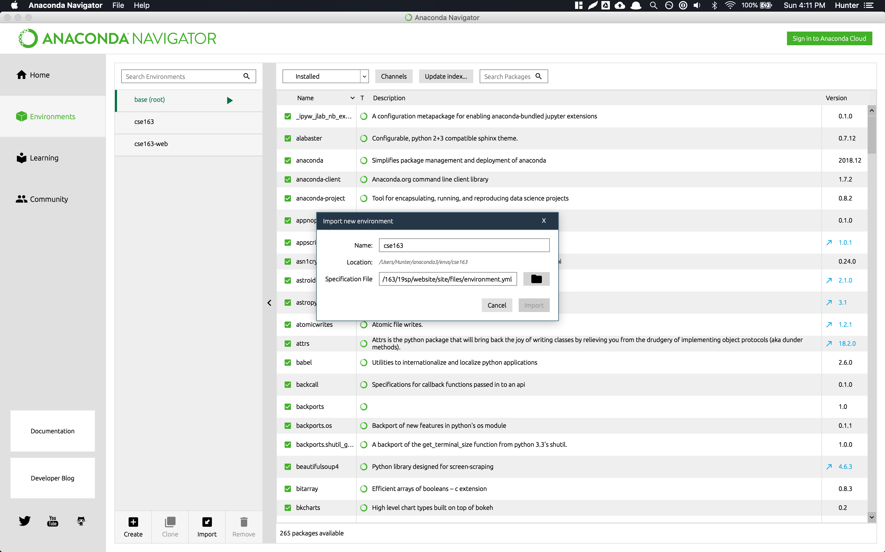
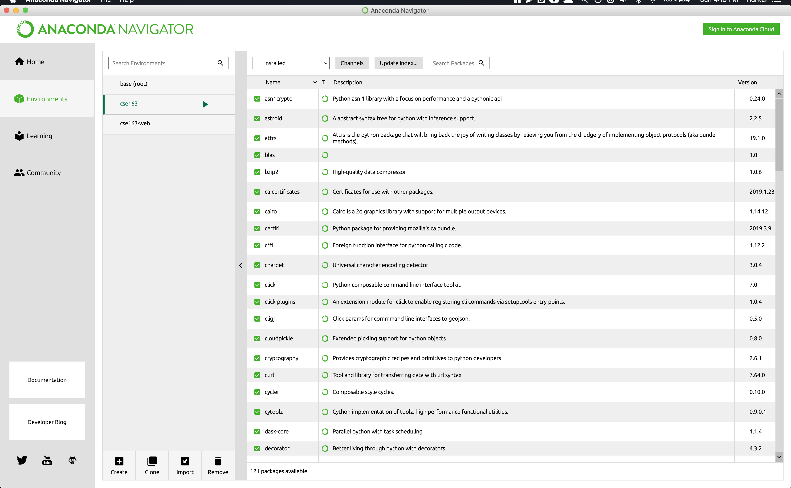
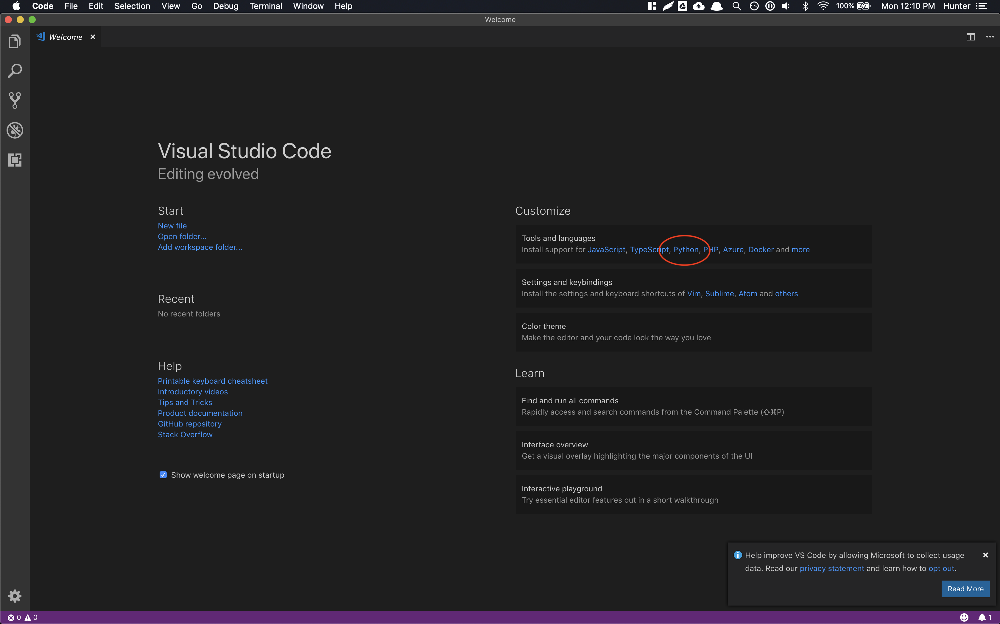
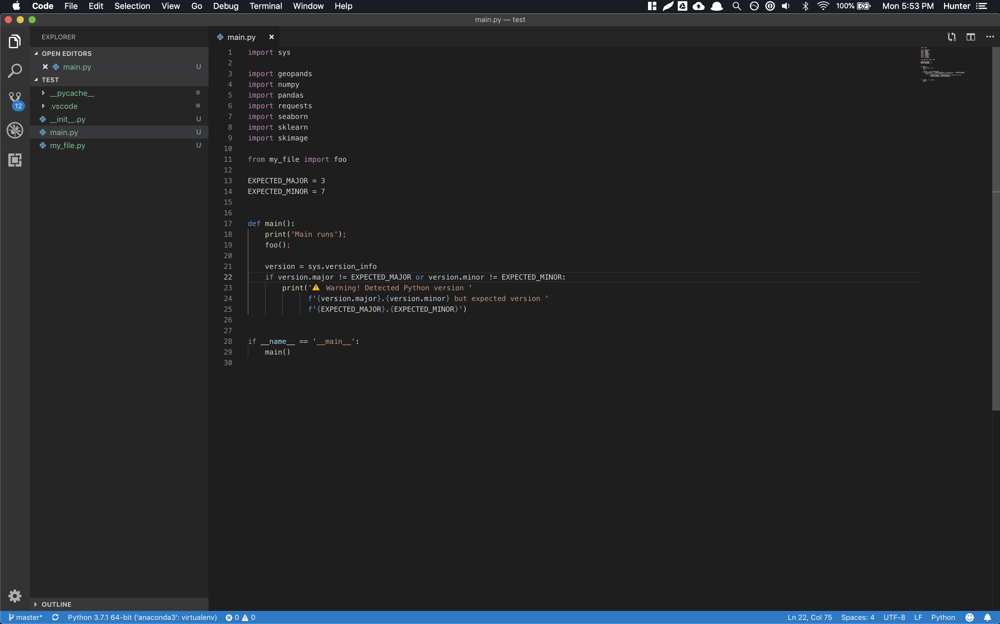
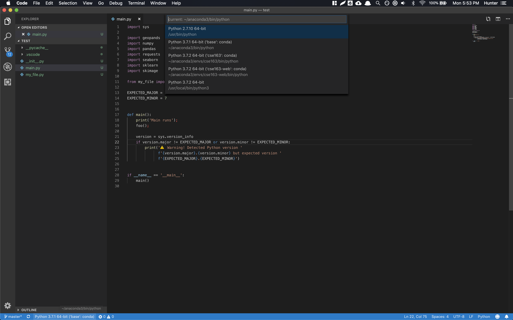

# Software Setup

This page contains common instructions for downloading software to run and edit Python files.

_Preface:_ Getting a development environment set up is easily one of the most frustrating things about being a programmer, so it's okay if this process doesn't go smoothly! If you run into troubles along the way, please make sure to post on the message board, come to office hours, or just Google around to see if you can solve the problem on your own!

```{warning} Warning

If you are using this book as part of a course, your instructor may have differing instructions for
software setup and tools used, or they might even have provided software installed on computers.
Please refer to any instructions your instructor has provided for software for your course.
```

## Instructions

### Step 1 - Install Anaconda

````{admonition} If you already have Anaconda 3 installed with a version of Python **before** 3.8
:class: dropdown

You should open up terminal/command prompt and run the commands:

```text
conda update conda
conda install python=3.8
```

You may then skip this Step ! after you have successfully installed Python 3.8.
````

Go to [Anaconda's website](https://www.anaconda.com/distribution/) and install `Python 3.8` for whichever operating system you own.

Once installed, you should open the Anaconda Navigator application and you will see a screen like:



### Step 2 - Create Environment and Install Python Packages

Download the {download}`environment.yaml` (right-click and "Save Link As") somewhere on your computer. This file specifies all of the requisite Python packages and their versions. The location of this file does not matter as long as you remember where you saved it.

Navigate to the Environments section on the left, and click the Import button at the bottom. Click on the folder icon, navigate to and select the `environment.yaml` file you downloaded earlier. In the prompt after selecting the environment specification, you should name the environment `cse163`. Once you have done this and created the environment, it will install all of the necessary packages.



After all the packages have been installed, you should see an environment called `cse163` and if you select it, will have many packages installed. Clicking on the environment should show you something that looks like a list of Python packages:



### Step 3 - Install Visual Studio Code

Go to [Visual Studio Code's website](https://code.visualstudio.com/) and install the IDE for whichever operating system you own.

Once installed, you should open the Visual Studio Code application and should see a screen like below. You should click the Python link circled in red to install the VSCode Python plugins 

### Step 4 - Set Up VSCode for Python Development

Download {download}`test.zip` to whichever directory you plan to use to store homework assignments and unzip it so you have a `test` directory in your working directory. If you click the "Open Folder" button on the welcome page of the VSCode application and select the `test` directory, you should then see the following editor if you click on the `main.py` on the left. It is entirely expected that you might see some errors when you first open the file!



The first import shows up as red since VSCode is most likely not using the `cse163` Anaconda environment we just set up. In the blue bar at the bottom in the above image, you should see which version of Python VSCode is currently using. Click on it and a prompt should appear for you to select, and you should find the one relating to the `cse163` Anaconda environment (should be something like `anaconda/envs/cse163/bin/python`, but may be different based on your operating system) which is circled in red in the diagram below. Once you selected the `cse163` environment, you should no longer get a warning about not being able to import `geopandas` if there was one earlier.



> #### If you are using Windows
>
> If you have Windows 10, VSCode will use PowerShell as the default program when you try to run a Python program, but unfortunately this does not work with Anaconda. To fix this, open up **Preferences**, search for "Shell" and change the value of **Terminal > Integrated > Shell: Windows** to `C:\Windows\System32\cmd.exe` (or wherever the program for Command Prompt exists on your machine).
> It seems like some newer versions of VS Code don't let you set this property directly, but rather require you to edit this thing called `settings.json`. If you follow the instructions above and only see an option to edit this file, do so and make it so it has the following contents:
>
>     {
>         "terminal.integrated.shell.windows": "C:\\Windows\\System32\\cmd.exe"
>     }
>
> Notice that this is the same path as above, with but with the back-slashes doubled to make it a valid escape-sequence.

### Step 5 - Set Up Linter: `flake8`

During this process, you may have also gotten a pop-up about selecting a linter (a program that checks your program for style errors). You should use `flake8` as a linter for this class. If you missed the pop-up, that's okay just follow these steps:

- Open the Command Pallet (`Shift+Cmd+P` on Mac, `Ctrl+Shift+P` on Windows/Linux)
- Type `>Python: Select Linter` and select `flake8`
- You might also need to enable the linter by typing `>Python: Enable Linter` and selecting `on`

It's intended that there are linter errors in the provided code so you can see that it is working. Don't fix these yet.

### Step 6 - Verify Everything Works

- With `main.py` open, right click in the main editor window and select "Run Python File in Terminal". This will open up a window at the bottom and after a second, should print out

      Main runs
      Foo runs

  if you have set up the environment correctly. It might also print out a warning if it looks like you are using the wrong version of Python.

- There should be multiple style warnings from `flake8` (seen with the error count at the bottom, or the red squiggly lines in the editor) from the fact that we used semi-colons to end lines 18 and 19 and had imports that were unused. For this exercise, you should leave the unused imports in the code but you should delete those semi-colons and save the file to rerun `flake8` and verify those errors should go away.

Once you have done this, you now have a Python environment that runs the code we will need for this class as well as runs a linter to verify your solution follows good style. If either of these two steps above don't work, please post on the message board, come to office hours, or try to Google around to see if you can get it working on your own!

## Frequently Asked Questions (FAQ)

```{admonition} Q: I can't run anything in the terminal in VSCode, what do I do?
:class: dropdown

A: It's likely that your program crashed due to an error interpreting your code. If you wrote the incorrect syntax, Python crashes but does not exit which will cause errors if you try clicking the "Run in Terminal" button again. To fix this, you must exit the Python interpreter by clicking on the terminal prompt and typing in `Ctrl-D` to exit. Once you do this, you should be able to re-run your program.

  Tip: I commonly only use "Run in Terminal" only once to generate the proper command, and then I will always just use the terminal to run by pressing the "up" key to get the previous command. This way, you won't forget to exit the Python shell since you actually have to work with that shell. This is not necessary, but something that has helped me avoid this bug.
```

```{admonition} Q: I did the whole setup, but <code>flake8</code> doesn't highlight any errors. How do I fix this?
:class: dropdown

A: We'll first start with some background to understand why this happens. This seems to be a problem from a recent release of VSCode. It seems like when you specify `flake8` as the linter, it doesn't look in your activated Anaconda environment for it. Instead, it looks in your default Python installation (which most likely doesn't have `flake8` installed). So it looks like to make it work, you will have to explicitly tell VS Code to use `flake8` that you installed in the `cse163` environment.

To do this, first, run the `main.py` file in VS Code by right-clicking the file and click `Run Python File in Terminal`. This is to set up the terminal to be in the correct state for the next step.

Next, you will have to type a command into the terminal based on which operating system you use:

- If you use Windows, type: `where flake8`
- If you use Mac or Linux, type: `which flake8`

Both of these commands should spit out a path to a file. For Windows, it will look something like `C:\Users\hschafer\Anaconda3\envs\cse163\Scritps\flake8.exe` and for Mac/Linux it will look something like `/Users/Hunter/anaconda3/envs/cse163/bin/flake8`. This output is the proper path to the `flake8` program. **Copy this path since we will need it in a minute**.

Open up the Preferences of VSCode and search for "flake8". There is a setting called `Python > Linting: **Flake8Path**` that probably has the value `flake8` currently. Delete that value and paste the output path from the last command here. Once you save, it should hopefully work now!

```
